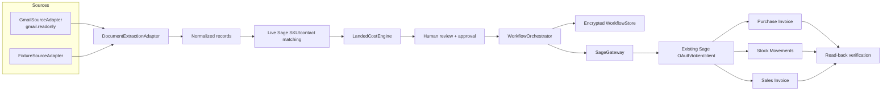

# Synpath document-to-Sage architecture

## Scope

This is an architecture-first implementation for UK Sage Accounting API v3.1.
The current extractor is a fixture adapter; it is explicitly labelled as such in
the UI and must not be represented as live AI extraction.

There is no Sage Purchase Order in this workflow. `GHOACRUGOL051926` is an
external business reference stored by Synpath and copied into Sage transaction
references/notes.

## Architecture



## Module boundaries

- `api/_lib/gmail/auth.ts`: Google OAuth, refresh and encrypted HttpOnly session.
- `api/_lib/gmail/client.ts`: Gmail list/get/attachment API and
  `GmailSourceAdapter`.
- `api/_lib/gmail/mime.ts`: recursive MIME parsing and base64url decoding.
- `api/_lib/workflow/sourceAdapters.ts`: common source interface and fixture source.
- `api/_lib/workflow/extraction.ts`: `DocumentExtractionAdapter` and
  `FixtureDocumentExtractionAdapter`.
- `api/_lib/workflow/landedCostEngine.ts`: allocation, reconciliation and tax
  classification.
- `api/_lib/workflow/sageGateway.ts`: business-level Sage reads, payload builders,
  guarded writes and read-back.
- `api/_lib/workflow/orchestrator.ts`: approvals, idempotency, partial failure and
  transaction sequencing.
- `api/_lib/workflow/store.ts`: compact encrypted HttpOnly workflow state.
- `shared/workflow.ts`: normalized records shared by browser and server.
- `src/components/sage/workflow/*`: three executive-facing workflow steps.

### Existing Sage modules reused

- `api/_lib/sage/auth.ts` — unchanged Sage authorization and refresh flow.
- `api/_lib/sage/tokenStore.ts` — existing AES-256-GCM implementation, extended
  with a selectable encryption-key environment variable.
- `api/_lib/sage/client.ts` — existing Sage HTTP/error handling and stock/invoice
  functions, extended with OpenAPI-aligned resources.
- `api/_lib/sage/router.ts`, `api/sage.ts` — existing single-Vercel-function
  deployment pattern.
- `src/lib/sageApi.ts`, `SageLayout`, `StatusBadge` — connection and UI shell.

### Replaced workflow

The old Product Sync, SKU Update, mock price-email and simulated PO tabs were
removed from the main UI. Product sync is now part of live SKU matching. The
existing Sage OAuth is not replaced.

## Gmail configuration

Set these server-side Vercel environment variables and redeploy:

```text
GOOGLE_CLIENT_ID
GOOGLE_CLIENT_SECRET
GOOGLE_REDIRECT_URI=https://www.getsynpath-ai.com/api/gmail/oauth/callback
GOOGLE_GMAIL_SCOPES=https://www.googleapis.com/auth/gmail.readonly
GOOGLE_TOKEN_ENCRYPTION_KEY
```

The uploaded OAuth JSON is a Google **web** client and already lists the callback
above. Do not commit that JSON or its secret. Add the callback to the Google
OAuth client's authorized redirect URIs if it changes.

The initial implementation requests read-only Gmail access. It does not send,
delete, label or mark mail as processed.

## Local setup

1. Copy `.env.example` to `.env.local` and add Sage/Google values.
2. Use `vercel dev` for OAuth/serverless API testing. Plain `npm run dev` serves
   only the Vite SPA.
3. Run:

```bash
npm install
npm test
npm run lint
npm run build
```

Never run destructive live Sage tests automatically.

## Fixture test

1. Open `/sage-integration`.
2. Leave **Fixture + Dry Run** selected.
3. Click **Load workflow**.
4. Confirm the UI says fixture extraction is not live AI extraction.
5. Correct quantities/costs if desired and click **Recalculate preview**.
6. Confirm the reconciliation variance is zero.
7. Review Purchase Invoice, Stock Movement and Sales Invoice payloads.
8. Confirm no Sage posting records appear in dry-run mode.

The synthetic files are in `fixtures/sage-workflow/`.

## Testing the real Gmail adapter with synthetic files

1. Email or forward the files in `fixtures/sage-workflow/` to the connected
   Gmail account.
2. Apply label `Synpath Sage Demo`.
3. Connect Gmail from the workflow.
4. Search with `label:"Synpath Sage Demo" has:attachment` or
   `"GHOACRUGOL051926"`.
5. Select one or more messages and load **Gmail + Dry Run**.

Gmail attachment bytes remain in Gmail and are re-fetched by message/attachment
ID. Synpath stores compact IDs, hashes, approvals and Sage IDs in the encrypted
workflow store.

## Manual live Sage test checklist

1. Connect Gmail.
2. Send or forward synthetic sample emails into the connected mailbox.
3. Apply the configured Gmail label.
4. Click Sync from Gmail.
5. Confirm emails and attachments appear.
6. Group/select them under `GHOACRUGOL051926`.
7. Review fixture extraction results.
8. Match SKUs against live Sage Stock Items.
9. Calculate and reconcile landed costs.
10. Run Purchase Invoice preview in dry-run.
11. Run Stock Movement preview in dry-run.
12. Enable **Live Sage Write**.
13. Confirm supplier, customer, tax and ledger mappings with accounting.
14. Type the exact generated `DEMO-GHOACRUGOL051926-YYYYMMDD-*` reference.
15. Separately approve and create one demo Purchase Invoice.
16. Confirm its Sage ID and read-back status.
17. Choose `stock_movement`, separately approve, and create demo Stock Movements.
18. Reload Sage Stock Items and verify actual quantity/cost.
19. Review and approve the Customer Invoice.
20. Create one demo Sales Invoice and verify its read-back.
21. Approve invoice release separately if release is required.

If Purchase Invoice succeeds but a Stock Movement fails, do not delete the
invoice. The run displays Partial Completion and retry skips successful SKU
movements.

## Inventory strategy

- `stock_movement` creates one positive movement per matched SKU using approved
  landed unit cost.
- `purchase_invoice_product_lines` includes `product_id` on the Purchase Invoice
  and disables separate Stock Movements.
- Default is `none`; inventory posting is blocked until selected and approved.

Sage Stock Movements have no `purchase_invoice_id`. Synpath maintains the
relationship through workflow state and the shared external reference.

## Known limitations

- No project database exists. The smallest persistence layer is one compressed,
  encrypted HttpOnly workflow cookie. It is browser-scoped and suitable for this
  architecture demo, not multi-user production operations. Move
  `WorkflowStore` to Postgres/KV/object storage before production onboarding.
- Gmail attachment binaries are not copied into the cookie. They remain in
  Gmail and are re-fetched securely; immutable fixture binaries remain in code.
- Real customer documents have not arrived. Classification and extraction use
  fixture normalized results.
- Accounting must confirm purchase/sales ledger IDs, tax treatment, invoice
  draft/release policy, inventory strategy and treatment of freight/duty.
- Live writes are not exercised in CI.

## Future real extraction connection point

Implement a new class satisfying `DocumentExtractionAdapter` in
`api/_lib/workflow/extraction.ts`, then inject it in
`api/_lib/workflow/router.ts`. Gmail, normalized schemas, landed costs, review
UI, approvals, orchestration, Sage payloads and read-back do not need redesign.
